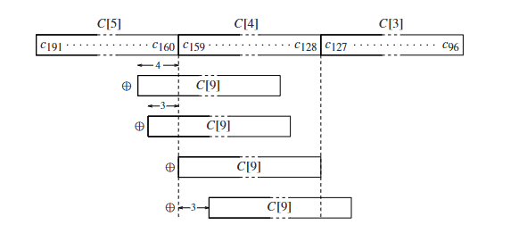

# 代码介绍及原理

## 使用到的库

- `<stdio.h>`：标准输入输出库，用于文件操作和打印输出。
- `<stdint.h>`：标准整数类型库，定义了固定宽度的整数类型，如本代码中频繁使用的`uint64_t`。

- `<immintrin.h>`：包含了 Intel 的 SIMD 指令集（SSE2 和 PCLMULQDQ）的头文件，用于加速计算。

- `<time.h>`：时间库，用于获取当前时间戳，进行性能分析。

## 函数介绍

- `gf_print()`：以形如 $x^{130} + x^{129} + \dots$ 格式输出多项式。
- `gf_add()`：有限域下的加法。
- `gf_mul()`：有限域下的乘法，共有`gf_mul_trivial(), gf_mul_bit(), gf_mul_smid()`三种实现，可以通过宏进行选择最终使用的版本。
- `gf_pow()`：有限域下的乘方运算，共有`gf_pow_trivial(), gf_pow_fast()`两种实现，可以通过宏进行选择最终使用的版本。
- `gf_pow2()`：有限域下的平方运算，共有`gf_pow2_bit(), gf_pow2_mul(), gf_pow2_simd()`三种实现，可以通过宏选择最终使用的版本。
- `gf_inv()`：有限域下的求逆运算，共有`gf_inv_euclid(), gf_inv_fermat()`两种实现，可以通过宏选择最终使用的版本。
- `degree()`：计算多项式的度数。多项式为 0 时，返回-1。
- `left_shift()`：实现以 64 位整数数组表示的二进制数的左移。
- `now()`：获取当前时间戳。用在`test_mul_time(), test_pow2_time(), test_inv_time()`三个函数中，进行性能分析。以上四个函数仅供参考，在不同环境和语言标准下可能需要修改。

### 常量

- `M`：该有限域元素的最大项数

- `F[3]`：该有限域的不可约多项式

## 实验描述

### 实验背景

有限域$F_{2^{132}}$的不可约多项式是$f(x)=x^{131}+x^{13}+x^2+x+1$。 $F_{x^{132}}$ 中的每个元素形如 $a_0+a_1x+a_2x^2+\dots+a_{130}x^{130}$ ，其中 $a_i\in\{0, 1\}$ 。

所以在计算机中，我们只需要 131 位的比特串即可表示该有限域中的一个元素。用一个`uint64_t[3]`表示时，如下所示：

|             `uint64_t[2]`              |        `uint64_t[1]`         |       `uint64_t[0]`       |
| :------------------------------------: | :--------------------------: | :-----------------------: |
| $000\dots0a_{130}a_{129}\dots a_{128}$ | $a_{127}a_{126}\dots a_{64}$ | $a_{63}a_{62}\dots a_{0}$ |

考虑到两个多项式运算的结果，最多用 262 位就可以表示。所以本次实验中，全部使用`uint64_t[5]`来进行存储。

### 输入输出

实验的输入输出均为**小端序的二进制数据**。

**输入**：

1. 首先是一个`uint32_t`，表示需要进行的运算数量
2. 接下来是若干个运算操作，每个运算操作由以下两个部分组成：

   - 一个`uint8_t`表示要进行的运算的类型：
     - `0x00` 表示对两个多项式做加法
     - `0x01` 表示对两个多项式做乘法
     - `0x02` 表示对第一个多项式平方
     - `0x03` 表示对第一个多项式求逆
   - 一个`uint64_t[2][3]`表示两个多项式

例如：

```text
04 00 00 00

00
05 20 00 00 00 00 00 00
00 00 00 00 00 00 00 00
00 00 00 00 00 00 00 00
21 00 00 00 00 00 00 00
00 00 00 00 00 00 00 00
04 00 00 00 00 00 00 00

01
05 20 00 00 00 00 00 00
00 00 00 00 00 00 00 00
00 00 00 00 00 00 00 00
21 00 00 00 00 00 00 00
00 00 00 00 00 00 00 00
04 00 00 00 00 00 00 00

02
05 20 00 00 00 00 00 00
00 00 00 00 00 00 00 00
00 00 00 00 00 00 00 00
21 00 00 00 00 00 00 00
00 00 00 00 00 00 00 00
04 00 00 00 00 00 00 00

03
05 20 00 00 00 00 00 00
00 00 00 00 00 00 00 00
00 00 00 00 00 00 00 00
21 00 00 00 00 00 00 00
00 00 00 00 00 00 00 00
04 00 00 00 00 00 00 00
```

**注：为了方便查看，这里以 16 进制书写，且加入了换行。实际输入文件是二进制数据，且除了数据外，不存在换行符等。**

真实的样例可以查看`input1.bin`和`input2.bin`两个文件。

**输出**：

每一个运算操作都需要输出一个`uint64_t[3]`结果，未使用的高位需要全部设为 0，**不需要输出换行符**。

上面的样例对应的输出是：

```text
24 20 00 00 00 00 00 00
00 00 00 00 00 00 00 00
04 00 00 00 00 00 00 00

AB 10 04 02 00 00 00 00
00 00 00 00 00 00 00 00
04 00 00 00 00 00 00 00

11 00 00 04 00 00 00 00
00 00 00 00 00 00 00 00
00 00 00 00 00 00 00 00

7F 01 DD 8A ED DA 46 92
42 EF 37 99 F4 D0 F9 0D
03 00 00 00 00 00 00 00
```

对应的输出可以查看`output1.bin`和`output.bin`两个文件

## 代码原理

### 加法

由于该有限域内，多项式参数要么为 0 要么为 1，所以加法就等价于对应位做异或：

```c
void gf_add(uint64_t res[5], const uint64_t a[5], const uint64_t b[5])
{
    for (int i = 0; i < 3; i++)
    {
        res[i] = a[i] ^ b[i];
    }
}
```

### 乘法

#### `gf_mul_trivial()`

最一般的做法就是普通的多项式相乘，假设有两个多项式：

$$
a(x)=\sum_{i=0}^{130}a_ix^i, b(x)=\sum_{i=0}^{130}b_ix^i
$$

则有：

$$
c(x)=a(x)*b(x)=\sum_{i=0}^{130}\sum_{j=0}^{130}a_ib_jx^{i+j}
$$

容易知道结果 $c(x)$ 中， $x^i$ 对应的系数是 $\sum_{j}\sum_k a_jb_k, j+k=i$ 。所以利用两层循环，即可实现：

```C
void gf_mul_trivial(uint64_t res[5], const uint64_t a[5], const uint64_t b[5])
{
    uint64_t tem[5] = {0};
    for (int i = 0; i < 131; i++)
    {
        for (int j = 0; j < 131; j++)
        {
            int i1 = i / 64, i2 = i % 64;
            int j1 = j / 64, j2 = j % 64;
            int ij1 = (i + j) / 64, ij2 = (i + j) % 64;

            const uint64_t mask = 1;
            uint64_t ai = 0, bj = 0;
            if (a[i1] & (mask << i2))
                ai = 1;
            if (b[j1] & (mask << j2))
                bj = 1;

            tem[ij1] ^= (ai & bj) << ij2;
        }
    }
    gf_mod(res, tem);
}
```

由于我们是用 64 位整数数组储存多项式，所以要考虑第 $i$ 位落在哪个字中。还要注意有限域内，位相加等价于相异或，相乘等价于相与。

#### `gf_mul_bit()`

通过简单的位运算，也可以实现乘法。因为：

$$
c(x)=a(x)b(x)=\sum_{i=0}^{130}b_i a(x)x^i
$$

对于多项式 $a(x)$ ，乘以 $x^i$ 等价于将比特串左移， $b_i$ 的值决定是否要左移后的值是否要累加在结果上。由上述原理，可以写出代码如下：

```c
void gf_mul_bit(uint64_t res[5], const uint64_t a[5], const uint64_t b[5])
{
    uint64_t tem[5] = {0};
    uint64_t b_[5] = {0};
    for (int i = 0; i < 5; i++)
    {
        uint64_t mask = 1;
        for (int j = 0; j < 64; j++)
        {
            if (a[i] & mask)
            {

                left_shift(b_, b, i * 64 + j);
                for (int k = 0; k < 5; k++)
                    tem[k] = tem[k] ^ b_[k];
            }
            mask <<= 1;
        }
    }
    gf_mod(res, tem);
}
```

要注意不能直接对原比特串移位。

#### `gf_mul_simd()`

$n$ 位整数乘法的复杂度是 $O(n^2)$ ，加法的复杂度是 $O(n)$ 。所以做大数乘法时，减少乘法的次数或降低参与乘法的数的位数可以加速匀速。基于这个思想有 **Karatsuba 算法**，该算法的原理是将大数拆成几部分，分别计算各部分的乘积，最后合并结果。

对于本实验而言，运算数天然拆成了三份，假如记比特串为 $A$，则有：

$$
A=A_22^{128}+A_12^{64}+A_0
$$

其中 $A_2, A_1, A_0$ 都是 64 位的二进制数。

于是，两个比特串相乘可以写为：

$$
\begin{align}
AB=&(A_2 2^{128}+A_1 2^{64}+A_0)(B_2 2^{128}+B_1 2^{64}+B_0)\\
=&A_2B_2 2^{256}+(A_2B_1+A_1B_2) 2^{192}+(A_2B_0+A_0B_2+A_1B_1) 2^{128}\\
&+(A_1B_0+A_0B_1) 2^{64}+A_0B_0\\
=&A_2B_2 2^{256}+[(A_1+A_2)(B_1+B_2)-A_1A_2-B_1B_2] 2^{192}\\
&+[(A_0+A_2)(B_0+B_2)-A_0B_0-A_2B_2+A_1B_1] 2^{128}\\
&+[(A_0+A_1)(B_0+B_1)-A_0A_1-B_0B_1] 2^{64}+A_0B_0
\end{align}
$$

记基本乘积：

$$
P_1=A_0B_0, P1=A_1B_1, P_2=A_2B_2
$$

记基本和：

$$
S_0=A_0+A_1, S_1=A_1+A_2, S_2=A_0+A_2, S_3=B_0+B_1, S_4=B_1+B_2, S_5=B_0+B_2
$$

然后计算交叉和：

$$
P_3=S_0S_3-P_0-P_1, P_4=S_2S_5-P_0-P_2, P_5=S_1S_4-P_1-P_2
$$

注意 $P_i$ 都是 128 位， $S_i$ 都是 64 位。记 $P_{ih}$ 为 $P_i$ 的高 64 位， $P_{il}$ 为 $P_i$ 的低 64 位，于是最终的结果可以表示为：

|  `uint64_t[4]`  |    `uint64_t[3]`     |    `uint64_t[2]`     |  `uint64_t[1]`  | `uint64_t[0]` |
| :-------------: | :------------------: | :------------------: | :-------------: | :-----------: |
| $P_{2l}+P_{5h}$ | $P_{5l}+(P_1+P_4)_h$ | $P_{3h}+(P_1+P_4)_l$ | $P_{3l}+P_{0h}$ |   $P_{0l}$    |

`uint64_t[5]`一定为全 0。

于是可以写出代码：

```c
void gf_mul_simd(uint64_t res[5], const uint64_t a[5], const uint64_t b[5])
{
    __m128i A0 = _mm_set_epi64x(0, a[0]);
    __m128i A1 = _mm_set_epi64x(0, a[1]);
    __m128i A2 = _mm_set_epi64x(0, a[2]);
    __m128i B0 = _mm_set_epi64x(0, b[0]);
    __m128i B1 = _mm_set_epi64x(0, b[1]);
    __m128i B2 = _mm_set_epi64x(0, b[2]);

    __m128i S0 = _mm_xor_si128(A0, A1);
    __m128i S1 = _mm_xor_si128(A1, A2);
    __m128i S2 = _mm_xor_si128(A0, A2);
    __m128i S3 = _mm_xor_si128(B0, B1);
    __m128i S4 = _mm_xor_si128(B1, B2);
    __m128i S5 = _mm_xor_si128(B0, B2);

    __m128i P0 = _mm_clmulepi64_si128(A0, B0, 0x00);
    __m128i P1 = _mm_clmulepi64_si128(A1, B1, 0x00);
    __m128i P2 = _mm_clmulepi64_si128(A2, B2, 0x00);
    __m128i P3 = _mm_xor_si128(_mm_clmulepi64_si128(S0, S3, 0x00), _mm_xor_si128(P0, P1));
    __m128i P4 = _mm_xor_si128(_mm_clmulepi64_si128(S2, S5, 0x00), _mm_xor_si128(P0, P2));
    __m128i P5 = _mm_xor_si128(_mm_clmulepi64_si128(S1, S4, 0x00), _mm_xor_si128(P1, P2));

    uint64_t tem[5] = {0};
    tem[0] = _mm_extract_epi64(P0, 0);
    tem[1] = _mm_extract_epi64(P3, 0) ^ _mm_extract_epi64(P0, 1);
    tem[2] = _mm_extract_epi64(_mm_xor_si128(P1, P4), 0) ^ _mm_extract_epi64(P3, 1);
    tem[3] = _mm_extract_epi64(P5, 0) ^ _mm_extract_epi64(_mm_xor_si128(P1, P4), 1);
    tem[4] = _mm_extract_epi64(P2, 0) ^ _mm_extract_epi64(P5, 1);
    // tem[5] = _mm_extract_epi64(P2, 1);

    gf_mod(res, tem);
}
```

这里还用到了 SIMD 指令来进行加速：

- `_mm_set_epi64x(0, a[0])`：将`a[0]`设置到一个 128 位向量`__m128`的低 64 位中

- `_mm_xor_si128()`： 对两个 128 位向量进行按位异或操作

- `_mm_clmulepi64_si128(A0, B0, 0X00)`：取`A0`和`B0`向量的低 64 位进行**无进位乘法**，这属于 PCLMULQDQ（Packed Carry-Less Multiplication Quadword）指令，是 Intel 的 SSE4.2 指令集的一部分。

- `_mm_extract_epi64(P0, _)`：从 128 位向量中提取 64 位整数。第二个参数设置为 0 时取低 64 位，第二个参数设置为 1 时取高 64 位。

思路参考了这篇论文 [ECC2-131 的并行 Pollard rho 算法实现分析](http://www.jcr.cacrnet.org.cn/CN/Y2022/V9/I2/322)，具体过程进行了修改，并不完全与论文一致。

### 取模

思路参考了《Guide to elliptic curve cryptography》一书中 2.3.5 节提到的，对于特殊形式的不可约多项式，可以简单地通过位运算的方式，快速取模。书中给了针对 FIPS 186-2 标准中推荐的几个多项式进行快速取模的算法。

我们利用相同的思路，因为不可约多项式为 $f(x)=x^{131}+x^{13}+x^2+x+1$ ，所以有：

$$
x^{131}\equiv x^{13}+x^2+x+1 \mod f(x)
$$

要取模的数假设为：

|          C[4]           |          C[3]           |          C[2]           |             C[1]             |           C[0]            |
| :---------------------: | :---------------------: | :---------------------: | :--------------------------: | :-----------------------: |
| $a_{319}\dots  a_{256}$ | $a_{255}\dots  a_{192}$ | $a_{191}\dots  a_{128}$ | $a_{127}a_{126}\dots a_{64}$ | $a_{63}a_{62}\dots a_{0}$ |

考虑对 C[3]进行约简。因为：

$$
\begin{align}
a_{255}x^{255}\equiv& a_{255}x^{137}+a_{255}x^{126}+a_{255}x^{125}+a_{255}x^{124}&\mod f(x)\\
a_{254}x^{254}\equiv& a_{254}x^{136}+a_{254}x^{125}+a_{254}x^{124}+a_{254}x^{123}&\mod f(x)\\
&\vdots\\
a_{192}x^{192}\equiv& a_{192}x^{74}+a_{192}x^{63}+a_{192}x^{62}+a_{192}x^{61}&\mod f(x)
\end{align}
$$

这些式子累加后，可以发现 C[3]约简后的结果，相当于将 C[3]这个比特串进行移位到 C[2]~C[0]对应区域上，如下是一个示意图（仅示意，数据不对应）：



于是，我们可以通过位运算来实现快速取模。论文 [ECC2-131 的并行 Pollard rho 算法实现分析](http://www.jcr.cacrnet.org.cn/CN/Y2022/V9/I2/322)中有取模的伪代码。但是存在错误。正确的算法应该为：

```c
void gf_mod(uint64_t res[5], const uint64_t a[5])
{
    uint64_t e[5];
    for (int i = 0; i < 5; i++)
    {
        e[i] = a[i];
    }

    for (int i = 4; i >= 3; i--)
    {
        uint64_t t = e[i];
        e[i - 3] = e[i - 3] ^ (t << 61) ^ (t << 62) ^ (t << 63);
        e[i - 2] = e[i - 2] ^ (t << 10) ^ (t >> 1) ^ (t >> 2) ^ (t >> 3);
        e[i - 1] = e[i - 1] ^ (t >> 54);
    }

    uint64_t t = e[2] >> 3;
    res[0] = e[0] ^ (t << 13) ^ t ^ (t << 1) ^ (t << 2);
    res[1] = e[1] ^ (t >> 51);
    res[2] = e[2] & 0x7;
}
```

### 平方

#### `gf_pow2_mul()`

即直接调用乘法的代码：

```c
void gf_pow2_mul(uint64_t res[5], const uint64_t a[5])
{
    gf_mul_simd(res, a, a);
}
```

#### `gf_pow2_bit()`

类似于位运算做乘法的思路。但由于是平方，可以消去许多项：

$$
c(x)=a(x)*a(x)
$$

考虑 $x^i$ 那项的系数 $\sum_{j=0}^ia_ja_{i-j}$ ，当 $i$ 为偶数时，由对称性：

$$
\sum_{j=0}^ia_ja_{i-j}=\sum_{j=0}^{i/2}(a_ja_{i-j}+a_ja_{i-j})+a_{i/2}a_{i/2}
$$

由有限域的性质，两相同数相加等于两相同数异或，消除；两相同数相乘等于相与，就是原数，则 $x^i$ 的系数为 $a_{i/2}$ 。

同理， $i$ 为奇数时，可得系数为 0。

综上：

$$
c(x)=a(x)*a(x)=\sum_{i=0}^{130}a_ix^{2i}
$$

于是可以写出代码：

```c
void gf_pow2_bit(uint64_t res[5], const uint64_t a[5])
{
    uint64_t tem[5] = {0};
    for (int i = 0; i < 5; i++)
    {
        for (int j = 0; j < 64; j++)
        {
            int i_ = ((i * 64 + j) * 2) / 64;
            int j_ = (i * 64 + j) * 2 % 64;

            uint64_t mask = 1;
            if (a[i] & (mask << j))
            {
                tem[i_] |= mask << j_;
            }
        }
    }
    gf_mod(res, tem);
}
```

#### `gf_pow2_simd()`

与乘法是相同的思路，同样利用 Karatsuba 算法，推导略去。由于是相同的数相乘，仅需计算三个交叉和：

```c
void gf_pow2_simd(uint64_t res[5], const uint64_t a[5])
{
    __m128i A0 = _mm_set_epi64x(0, a[0]);
    __m128i A1 = _mm_set_epi64x(0, a[1]);
    __m128i A2 = _mm_set_epi64x(0, a[2]);

    __m128i P0 = _mm_clmulepi64_si128(A0, A0, 0x00);
    __m128i P1 = _mm_clmulepi64_si128(A1, A1, 0x00);
    __m128i P2 = _mm_clmulepi64_si128(A2, A2, 0x00);

    uint64_t tem[5] = {0};
    tem[0] = _mm_extract_epi64(P0, 0);
    tem[1] = _mm_extract_epi64(P0, 1);
    tem[2] = _mm_extract_epi64(P1, 0);
    tem[3] = _mm_extract_epi64(P1, 1);
    tem[4] = _mm_extract_epi64(P2, 0);
    // tem[5] = _mm_extract_epi64(P2, 1);

    gf_mod(res, tem);
}
```

### 乘方

#### `gf_pow_trivial()`

直接调用`gf_mul()`，然后一个个相乘：

```c
void gf_pow_trivial(uint64_t res[5], const uint64_t a[5], uint64_t n)
{
    uint64_t tem[5] = {1, 0, 0, 0, 0};
    for (uint64_t i = 0; i < n; i++)
    {
        gf_mul(tem, tem, a);
    }
    gf_mod(res, tem);
}
```

#### `gf_pow_fast()`

利用快速幂的思路：

```c
void gf_pow_fast(uint64_t res[5], const uint64_t a[5], uint64_t n)
{
    uint64_t tem[5] = {1, 0, 0, 0, 0};
    uint64_t base[5];
    for (int i = 0; i < 5; i++)
    {
        base[i] = a[i];
    }
    while (n)
    {
        if (n & 1)
        {
            gf_mul(tem, tem, base);
        }
        gf_pow2(base, base);
        n >>= 1;
    }
    gf_mod(res, tem);
}
```

### 求逆

#### `gf_mod_euclid()`

借助拓展欧几里得算法，参考《Guide to elliptic curve cryptography》一书中 2.3.6 节的伪代码即可：

```c
void gf_inv_euclid(uint64_t res[5], const uint64_t a[5])
{
    uint64_t u[5] = {0}, v[5] = {0};
    for (int i = 0; i < 3; i++)
    {
        u[i] = a[i];
        v[i] = F[i];
    }

    uint64_t g1[5] = {1, 0, 0, 0, 0};
    uint64_t g2[5] = {0, 0, 0, 0, 0};
    uint64_t tem[5] = {0};
    while (degree(u))
    {
        int d = degree(u) - degree(v);

        if (d < 0)
        {
            for (int i = 0; i < 5; i++)
            {
                uint64_t tem = u[i];
                u[i] = v[i];
                v[i] = tem;
            }
            for (int i = 0; i < 5; i++)
            {
                uint64_t tem = g1[i];
                g1[i] = g2[i];
                g2[i] = tem;
            }
            d = -d;
        }

        left_shift(tem, v, d);
        for (int i = 0; i < 5; i++)
        {
            u[i] ^= tem[i];
        }

        left_shift(tem, g2, d);
        for (int i = 0; i < 5; i++)
        {
            g1[i] ^= tem[i];
        }
    }

    gf_mod(tem, g1);
    for (int i = 0; i < 5; i++)
    {
        res[i] = tem[i];
    }
}
```

#### `gf_inv_fermat()`

论文[A fast algorithm for computing multiplicative inverses in GF(2m) using normal bases](https://www.sciencedirect.com/science/article/pii/0890540188900247)提出了一种基于费马小定理和二进制展开的 **Itoh-Tsujii 算法**。

在 $F_{2^m}$ 中，由费马小定理有 $x^{2^m-1}\equiv 1\mod f(x)$ ，则有 $x^{2^m-2}\equiv x^{-1}\mod f(x)$ ，所以我们只要设法计算出 $x^{2^m-2}$ 即可。

本实验中 $m=132$ ， $2^{132-2}$ 已经超出了一般整数能表示的范围，所以不能直接调用`gf_pow()`。

一种方法是利用平方函数`gf_pow2()`，因为：

$$
x^{2^m-2}=(x^{2^{m-1}-1})^2=(x^{2^{m-2}+2^{m-3}+\dots+1})^2
$$

指数上是一个等比数列，用类似于快速幂的思想，记 $x_i=x^{2^i+2^{i-1}+\dots+1}$ ，则有：

$$
x_{i+1}=x^{2^{i+1}+2^i+\dots+1}=x^{2*(2^i+2^{i-1}+\dots+1)+1}=x_i^2*x
$$

按以上迭代过程，不难写出代码。

---

论文中的方法也是通过迭代先计算出 $x^{2^{m-1}-1}$ 。考虑$m-1$的二进制表示 $(a_0a_1\dots a_k)_2$，记 $n_i=(a_0a_1\dots a_i)_2$ ， $x_0=x=x^{2^{n_0}-1}$

当 $a_1$ 为偶数时，有 $n_1=2n_0$ ，且：

$$
x_0*x_0^{2^{n_0}}=x^{2^{n_0}-1}*x^{(2^{n_0}-1)2^{n_0}}=x^{2^{2n_0}-1}=x^{2^{n_1}-1}
$$

当 $a_2$ 为偶数时，有 $n_1=2n_0+1$ ，且：

$$
x(x_0x_0^{2^{n_0}})^2=x(x^{2^{2n_0}-1})^2=x^{2^{2n_0+1}-1}=x^{2^{n1}-1}
$$

一般地，有迭代过程：

$$
x_{i+1}=
\left \{
\begin{align}
x_ix_i^{2^{n_i}}&,a_{i+1}=0\\
x(x_ix_i^{2^{n_i}})^2&,a_{i+1}=1
\end{align}
\right.
$$

按照这样迭代，即有 $x_{i+1}=x^{2^{n_i}-1}$ ，所以 $x_{k+1}^2$ 取模后即是逆。代码如下：

```c
void gf_inv_fermat(uint64_t res[5], const uint64_t a[5])
{
    uint64_t x_i[5];
    for (int i = 0; i < 5; i++)
        x_i[i] = a[i];

    uint64_t n = M - 1;
    int bits = 0;
    while (n)
    {
        n >>= 1;
        bits++;
    }

    n = M - 1;
    uint64_t mask = 1ULL << (bits - 2);
    int n_i = 1;
    for (int i = 0; i < bits - 1; i++)
    {
        uint64_t tem[5] = {0};
        for (int j = 0; j < 5; j++)
            tem[j] = x_i[j];
        if (n & mask)
        {
            for (int j = 0; j < n_i; j++)
                gf_pow2(tem, tem);
            gf_mul(tem, x_i, tem);
            gf_pow2(tem, tem);
            gf_mul(x_i, a, tem);
            n_i = n_i * 2 + 1;
        }
        else
        {
            for (int j = 0; j < n_i; j++)
                gf_pow2(tem, tem);
            gf_mul(x_i, x_i, tem);
            n_i *= 2;
        }
        mask >>= 1;
    }
    gf_pow2(res, x_i);
}
```

注意由于指数大小的限制，这里计算 $x^{2^{n_i}}$ 时，仍然使用的是`gf_pow2()`

### 性能分析

由于影响因素较多，以下运行时间**仅提供数量级和大小关系的参考**。

#### 三种乘法函数的比较

为了防止偶然误差的影响，这里用让三种乘法对同一组数据重复运算 10000 次取均值，然后重复该实验 20 次。多次尝试后，结果相差不大，可认为基本排除误差。最终得到三种乘法所需的时间如下表所示：

| `gf_mul_trivial` | `gf_mul_bit` | `gf_mul_simd` |
| :--------------: | :----------: | :-----------: |
|     127383ns     |    995ns     |     64ns      |

多次尝试后，结果相差不大，可认为基本排除误差。

#### 三种平方的函数的比较

让三种平方对同一组数据重复运算 10000 次取均值，然后重复该实验 1000 次。最终得到三种平方所需的时间如下表所示：

| `gf_pow2_bit` | `gf_pow2_mul` | `gf_pow2_simd` |
| :-----------: | :-----------: | :------------: |
|    1172ns     |     56ns      |      37ns      |

#### 两种求逆的函数的比较

让两种求逆对同一个数据重复运算 10000 次取均值，然后重复该实验 10 次。最终得到两种求逆所需的时间如下表所示：

| `gf_inv_eculid` | `gf_inv_femart` |
| :-------------: | :-------------: |
|     81236ns     |     4498ns      |

### 思考题

本实验中有两道思考题：

#### 1

使用 Itoh-Tsujii 算法给出的迭代公式求逆，需要进行多少次乘法和平方？检查一下你实现的乘法和平方运算进行一次平均需要多少时间，然后根据计算量估计一次求逆需要的时间，并与实际的执行时间进行对比。

​

对于这题，可以直接设置变量进行计数。计数求得使用了平方 130 次，乘法 8 次。如果按照上面的数据，则求逆所需时间应该是 5322ns，与实际的 4498ns 比较接近。

#### 2

还有什么其他的方法从 $x$ 乘到 $x^{2^{131}-2}$ ？写出迭代过程，然后比较一下它们的计算量和实际运行时间是否存在区别。

另一种迭代法上面已给出。计数求得使用了平方 130 次，乘法 129 次。按照上面的数据求逆所需的时间应该是 13066ns，实际运行所需的时间则在 10000ns 左右，也相对比较接近。
